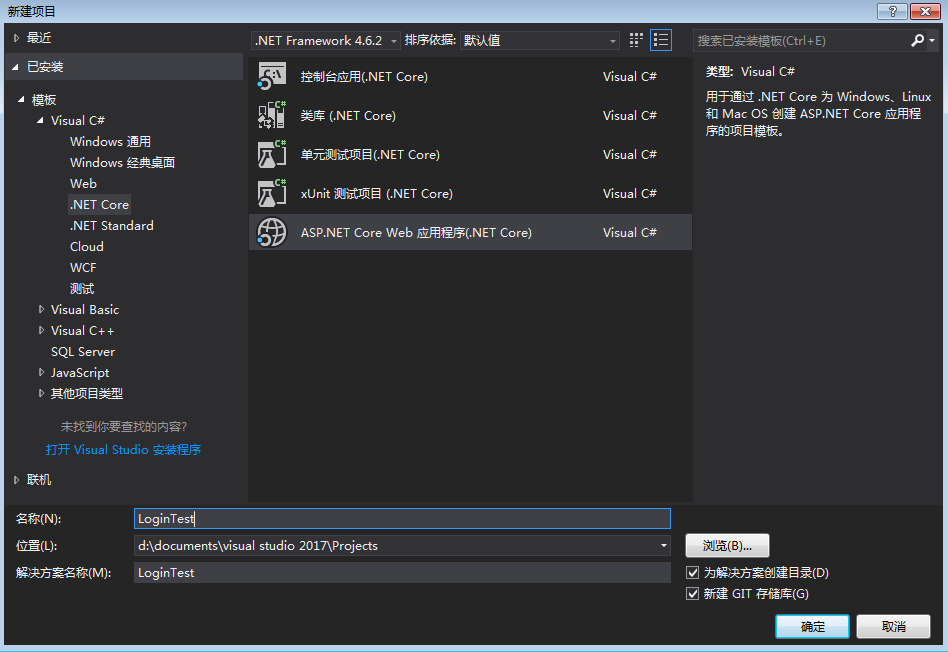
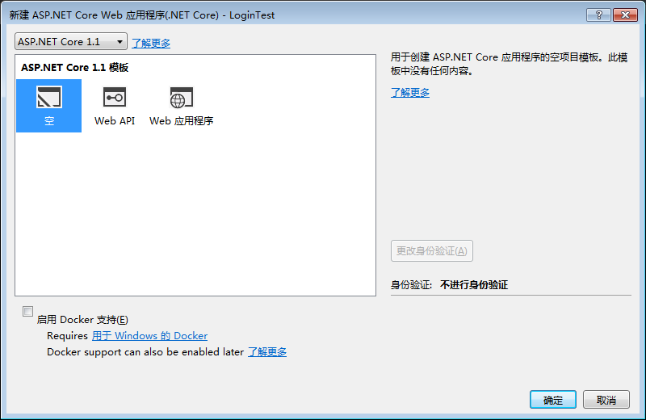
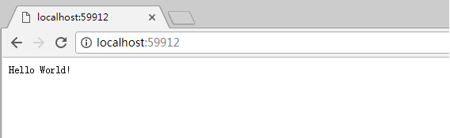
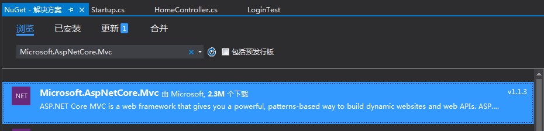
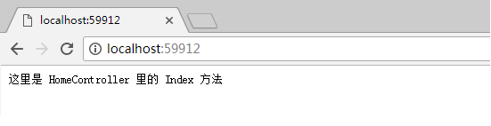
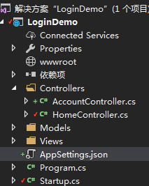
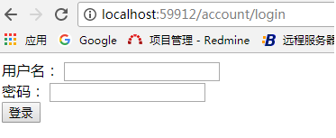
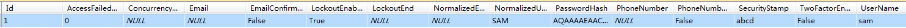

# ASP.NET Core 传统登录

#### 环境
 win7 64位、vs2017、Sqlserver 2012

#### 目的
实现用户登录

## 实现流程

### 1. 创建一个空的ASP.NET Core 1.1 的工程

  
  
​    
  创建好之后运行看看效果，如下
  

### 2.  添加首页

  创建文件夹 Controllers
  创建第一个Controller（HomeController）以及添加一个 Index 方法，代码如下

       ```c#
       using System;
       using System.Collections.Generic;
       using System.Linq;
       using System.Threading.Tasks;
    
       namespace LoginDemo.Controllers
       {
           public class HomeController
           {
               public string Index()
               {
                   return "我是首页";
               }
           }
       }
       ```

  此时运行 http://localhost:59912/home/index 发现结果还是和之前的一样，并没有调用 Index 方法, 网页中显示的还是`Hello World!`。这是因为我们没有配置路由，添加上路由。先把"Microsoft.AspNetCore.Mvc" 包按上，在 Startup.cs 文件中添加如下代码：

```c#
    using Microsoft.AspNetCore.Routing;

    public void ConfigureServices(IServiceCollection services)
    {
      //  这是增加的代码
      services.AddMvc();
    }

    // This method gets called by the runtime. Use this method to configure the HTTP request pipeline.
    public void Configure(IApplicationBuilder app, IHostingEnvironment env, ILoggerFactory loggerFactory)
    {
      loggerFactory.AddConsole();

      if (env.IsDevelopment())
      {
        app.UseDeveloperExceptionPage();
      }

      //  这是增加的代码
      app.UseMvc(ConfigureRoute);
      
      app.Run(async (context) =>
              {
                await context.Response.WriteAsync("Hello World!");
              });
    }
    private void ConfigureRoute(IRouteBuilder routeBuilder)
    {
      //Home/Index , 注意： = 两边不能有空格，否则路由无效。
      routeBuilder.MapRoute("Default", "{controller=Home}/{action=Index}/{id?}");
    }
```


  
  此时运行项目看到效果如下

### 3. 加访问限制

限制后的类和方法必须得登录用户才能访问。代码如下

```c#
using Microsoft.AspNetCore.Authorization; // [Authorize]
using System;
using System.Collections.Generic;
using System.Linq;
using System.Threading.Tasks;

namespace LoginDemo.Controllers
{
    [Authorize]
    public class HomeController
    {
        [AllowAnonymous]
        public string Index()
        {
            return "我是首页";
        }

        public string Jimi()
        {
            return "这是国家机密，非授权不能访问。";
        }
    }
}
```


### 4. 加入 Identity 登录机制。

#### 1. 添加 AccountController 类

 AccountController 用于实现用户注册、登入、登出。

```c#
using LoginDemo.Models; // for User
using Microsoft.AspNetCore.Identity; // for SignInManager
using Microsoft.AspNetCore.Mvc; // for Controller class
using System;
using System.Collections.Generic;
using System.Linq;
using System.Threading.Tasks;

namespace LoginDemo.Controllers
{
    public class AccountController: Controller
    {
        private UserManager<User>   _userManager;
        private SignInManager<User> _signManager;

        public AccountController(UserManager<User> userManager, SignInManager<User> signManager)
        {
            _userManager = userManager;
            _signManager = signManager;
        }

        public IActionResult Login()
        {
            return View();
        }

        [HttpPost]
        public async Task<IActionResult> Login(string Username, string Password)
        {
            if (ModelState.IsValid)
            {
                var result = await _signManager.PasswordSignInAsync(Username,
                    Password, false, false);
                if (result.Succeeded)
                {
                    return View("LoginOK");
                }
            }

            return View();
        }
    }
}
```

AccountController 类里的 _signManager 成员，需要添加 `Microsoft.AspNetCore.Identity` 包。

#### 2. 添加 User 类

AccountController  类用到了 User 类， User 类代码如下：

```c#
using Microsoft.AspNetCore.Identity.EntityFrameworkCore; // for IdentityUser
using System;
using System.Collections.Generic;
using System.Linq;
using System.Threading.Tasks;

namespace LoginDemo.Models
{
  public class User : IdentityUser
  {
  }
}
```

  User 类继承的 IdentityUser 类需要添加 `Microsoft.AspNetCore.Identity.EntityFrameworkCore` 包。

#### 3. 添加 Identity 和 Entity Framework 服务

要想 AccountController 类的初始化方法被系统顺利调用，得需要去 `Startup.cs`  文件中添加如下代码：

```c#
using LoginDemo.Models; // for User
using Microsoft.AspNetCore.Identity.EntityFrameworkCore; // for IdentityRole
using Microsoft.EntityFrameworkCore; // for option.UseSqlServer()
using Microsoft.Extensions.Configuration; // for ConfigurationBuilder

namespace LoginDemo
{
    public class Startup
    {
        public IConfigurationRoot Configuration { get; }

        public Startup(IHostingEnvironment env)
        {
            var builder = new ConfigurationBuilder()
                .SetBasePath(env.ContentRootPath)
                .AddJsonFile("AppSettings.json");
            Configuration = builder.Build();
        }

        // This method gets called by the runtime. Use this method to add services to the container.
        // For more information on how to configure your application, visit https://go.microsoft.com/fwlink/?LinkID=398940
        public void ConfigureServices(IServiceCollection services)
        {
            services.AddMvc();

            // 添加 Entity Framework 服务，并且使用SQL Server  服务。
            services.AddEntityFrameworkSqlServer().AddDbContext<LoginDemoDbContext>
                (option => option.UseSqlServer(Configuration["database:connection"]));
            // 添加 Identity 服务。
            // 当 Identity 和 Entity Framework 一起使用时，需要调用 AddEntityFrameworkStores 这个方法。
            // AddEntityFrameworkStores 会配置 UserStore 服务，
            // UserStore 服务用于创建用户验证密码。
            services.AddIdentity<User, IdentityRole>()
                .AddEntityFrameworkStores<LoginDemoDbContext>();
        }

       
        // This method gets called by the runtime. Use this method to configure the HTTP request pipeline.
        public void Configure(IApplicationBuilder app, IHostingEnvironment env, ILoggerFactory loggerFactory)
        {
            loggerFactory.AddConsole();

            if (env.IsDevelopment())
            {
                app.UseDeveloperExceptionPage();
            }

            // app.UseIdentity() 要在 app.UseMvc() 之前。
            app.UseIdentity();
            app.UseMvc(ConfigureRoute);

            app.Run(async (context) =>
            {
                await context.Response.WriteAsync("Hello World!");
            });
        }
    }
}
```

上面的代码需要添加这两个依赖项：`Microsoft.EntityFrameworkCore` 和`Microsoft.EntityFrameworkCore.SqlServer`。

数据库管理软件相应的信息添加到配置文件中：在工程中添加一个 'AppSettings.json' 文件，文件内容如下:

```json
{
  "database:connection": "Data Source=51ARXM3WXLOEEPH\\SQL2012;Initial Catalog=LoginDemo;User ID=sa;Password=Sa12345"
}
```



#### 4. 添加数据库操作类

数据库操作类`LoginDemoDbContext`代码如下：

```c#
using Microsoft.AspNetCore.Identity.EntityFrameworkCore; // for IdentityDbContext
using Microsoft.EntityFrameworkCore; // for DbContextOptionsBuilder
using System;
using System.Collections.Generic;
using System.Linq;
using System.Threading.Tasks;

namespace LoginDemo.Models
{
    // 负责同数据库打交道。
    public class LoginDemoDbContext : IdentityDbContext<User>
    {
        public LoginDemoDbContext(DbContextOptions<LoginDemoDbContext> options)
            : base(options) { }
    }
}
```
#### 5. 创建登录界面

​     在工程目录下创建 Views 文件夹，Views 文件夹下创建 Account 文件夹，Account 文件夹下创建一个  MVC 视图页: Login.cshtml。Login.cshtml 代码如下：

```html
<form method="post" asp-controller="Account" asp-action="Login">
    <div asp-validation-summary="ValidationSummary.ModelOnly"></div>
    <div>
        用户名：
        <input type="text" name="Username" />
    </div>

    <div>
        密码：
        <input type="text" name="Password" />
    </div>
    <div>
        <input type="submit" value="登录" />
    </div>
</form>
```

完成上述步骤后，在浏览器里输入`http://localhost:61732/account/login` 就能看到登录界面：



#### 6. 创建数据库和用户相关的表

##### 1. 添加 dotnet ef 命令需要的依赖包。

  * `Microsoft.EntityFrameworkCore.Design`, 可在 NuGet 安装。

  * `Microsoft.EntityFrameworkCore.Tools.DotNet` 不能用 NuGet 安装，需要手动编辑 `*.csproj` 文件。
       最终的工程文件应该包含下面这些依赖项（除了你自己其他的依赖项之外）
   ```xml
   <Project Sdk="Microsoft.NET.Sdk.Web">

     <PropertyGroup>
       <TargetFramework>netcoreapp1.1</TargetFramework>
     </PropertyGroup>

     <ItemGroup>
       <PackageReference Include="Microsoft.EntityFrameworkCore.Design" 
     </ItemGroup>
     <ItemGroup>
       <DotNetCliToolReference Include="Microsoft.EntityFrameworkCore.Tools.DotNet" Version="1.0.1" />
     </ItemGroup>

   </Project>
   ```

##### 2. 执行命令 `dotnet ef migrations add v1`

​    v1 是数据库的版本1。该命令会在项目中创建 `Migrations`  文件夹。一个 migration 本质上就是一段C# 代码，用于生成 SQL 命令， 以操作数据库 schema 。

##### 3. 执行命令`donet ef database update`, 生成数据库表。

##### 4. 创建一个用户

​    密码字段中填入下面内容`AQAAAAEAACcQAAAAEMwdA/IaxdC3AktbVcHC9Vi+vgSr5YpViowsbblsNypDLHUYIJuh63Ht8Y6k+BVSLg==`, 对应的密码是`Test123456-`

​    用户表中的各字段内容如下：

```sql
1	0	NULL	NULL	False	True	NULL	NULL	SAM	AQAAAAEAACcQAAAAEMwdA/IaxdC3AktbVcHC9Vi+vgSr5YpViowsbblsNypDLHUYIJuh63Ht8Y6k+BVSLg==	NULL	False	abcd	False	sam
```



​       创建完用户之后，可以使用 sam/Test123456- 访问 `localhost:59912/account/login`进行登录。